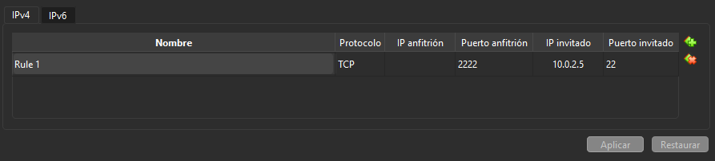

# Guía de Configuración: Ubuntu Server con KEA DHCP y BIND9

Guia detallada paso por paso para configurar un servidor DHCP (KEA) y un servidor DNS (BIND9) en Ubuntu Server, pudiendo hacer ping desde un cliente (Ubuntu Desktop)

> [!]
> Antes de empezar quiero aclarar que las pruebas se van a hacer con Virtual Box, con Hardware real algunas cosas podrían cambiar

## Máquinas utilizadas.
- **Ubuntu Server 26.04.1 (Dentro usaremos una red NAT y una Red interna)**
> [!]
> Requisitos minimos: 2GB RAM, 25GB Disco duro, 1 núcleo
- **Ubuntu Desktop / Lubuntu (Dentro usaremos una red NAT y Red interna)**
> [!]
> Requisitos minimos (Ubuntu Server): 6GB RAM, 25GB, 2 núcleos o más
---
> **Nota importante:** Es necesario que en ambas máquinas la red interna tengan el mismo nombre. Es decir debe quedar algo así:
> 
> ---
>
> - Ubuntu Server = intnet.
> - Ubuntu Desktop = intnet.

> Aparte recomiendo que a la hora de instalar Ubuntu Server antes de iniciar la máquina, lo mejor es establecer los adaptadores de red, ya que si desde un inicio estableces la Red NAT y la Red Interna después tendrás menos problemas sobretodo con SSH.

## Parámetros de la Red

- **Red (Subnet):** `172.16.0.0/12`
- **IP del Servidor (Host):** `172.16.0.1`
- **IP del Cliente (reserva DHCP):** `172.17.0.0`
- **Rango DHCP (Pool)**: `172.20.0.0 - 172.30.0.0`
- **Dominio:** `fp.internal`
- **Registros DNS**: `server (172.16.0.1) y cliente (172.17.0.0)`

# 0. Recomendación previa.
**Antes de empezar lo primero que recomiendo es ya que estamos usando VirtualBox, es configurar un reenvio de puertos para poder conectarse a la maquina por SSH, así podemos trabajar de manera más sencilla sin tener que copiar a mano cada uno de los comandos y códigos.**

Para esto haremos lo siguiente:

En la maquina **Ubuntu Server** usaremos el comando:
```
ip a
```
Observaremos que nos saldran dos interfaces de red si se ha configurado como se estableció al inicio (enp0s3) debe tener la IP de nuestra red NAT en este caso como yo estoy usando la predeterminada que te da virtualbox, mi ip es (10.0.2.5) pero ojo que puede cambiar.

En VirtualBox nos iremos a la sección de redes y configuraremos de la siguiente manera dentro de la sección de la red NAT.



Tras de esto podríamos conectarnos perfectamente mediante SSH usando el comando
```
ssh -p 2222 [TU_USUARIO]@localhost
```
Ahora actualizaremos los paquetes de Ubuntu Server
```
sudo apt update && sudo apt upgrade -y
```
# 1. Configuración de la IP Estática del Servidor.
Antes de instalar los servicios, el servidor necesita una IP estática.

Hay que editar el archivo del Netplan (el nombre puede variar, para esta configuración usaremos 00-installer-config.yaml)
```
sudo nano /etc/netplan/00-installer-config.yaml
```
Configuraremos de la siguiente manera:
```
# This is the network config written by 'subiquity'
network:
  ethernets:
    enp0s3:
      dhcp4: true
      dhcp6: false
    enp0s8:
      addresses: [172.16.0.1/12]
      accept-ra: true
      nameservers:
        search: [fp.internal]
        addresses: [172.16.0.1]
  version: 2
```
Tras de esto ejecutamos y comprobamos la ip
```
sudo netplan apply
ip a
```
# 2. Instalar y configurar Kea DHCP
```
sudo apt install -y kea-dhcp4-server
```
## Ahora configuraremos de la siguiente manera
```
sudo nano /etc/kea/kea-dhcp4.conf
```
### Archivo: /etc/kea/kea-dhcp4.conf:
```
{
  "Dhcp4": {
    "interfaces-config": {
      "interfaces": [ "enp0s8" ]
    },

    "control-socket": {
      "socket-type": "unix",
      "socket-name": "kea4-ctrl-socket"
    },

    "lease-database": {
      "type": "memfile",
      "lfc-interval": 3600
    },

    "authoritative": true,
    "valid-lifetime": 3600,
    "renew-timer": 1800,
    "rebind-timer": 3150,

    "option-data": [
      { "name": "domain-name-servers", "data": "172.16.0.1" },
      { "name": "domain-name", "data": "fp.internal" },
      { "name": "domain-search", "data": "fp.internal" }
    ],

    "subnet4": [
      {
        "id": 1,
        "subnet": "172.16.0.0/12",
        "pools": [
          { "pool": "172.20.0.0 - 172.30.0.0" }
        ],
        "option-data": [
          { "name": "routers", "data": "172.16.0.1" }
        ],
        "reservations": [
          {
            "hw-address": "MAC DE LA MÁQUINA CLIENTE",
            "ip-address": "172.17.0.0",
            "hostname": "cliente"
          }
        ]
      }
    ],

    "loggers": [
      {
        "name": "kea-dhcp4",
        "output-options": [
          { "output": "/var/log/kea/kea-dhcp4.log" }
        ],
        "severity": "INFO",
        "debuglevel": 0
      }
    ]
  }
}
```

> **Nota importante:** En la sección **reservations** la parte de hw-address está sin completar porque para esta necesitamos la MAC de la máquina cliente, para esto simplemente vamos a la maquina cliente y usamos el comando:
>```
> ip a
>```
> Nos quedaría algo como esto: 
>```
>3: enp0s8: <BROADCAST,MULTICAST,UP,LOWER_UP> mtu 1500 qdisc fq_codel state UP group default qlen 1000
>    link/ether 08:00:27:8e:d9:72 brd ff:ff:ff:ff:ff:ff
>    inet6 fe80::ec9f:8457:f697:c14f/64 scope link noprefixroute
>       valid_lft forever preferred_lft forever
>```
> La MAC del cliente sería **08:00:27:8e:d9:72**.
> Dentro de reservations quedaría así:
>```
>"reservations": [
>          {
>            "hw-address": "08:00:27:8e:d9:72"
>           "ip-address": "172.17.0.0",
>            "hostname": "cliente"
>          }
>        ]
>    ...
>```
## Arrancamos el servicio:
```
sudo systemctl enable --now kea-dhcp4-server
sudo systemctl status kea-dhcp4-server
```
Si sale que está "enabled" y "active" quiere decir que todo está perfectamente configurado, si sale como "failed" hay algún problema de sintaxis en /etc/kea/kea-dhcp4.conf
# 3. Instalar y configurar bind9.
```
sudo apt install -y bind9 bind9utils bind9-dnsutils
```
## Opciones generales
```
sudo nano /etc/bind/named.conf.options
```
```
options {
    directory "/var/cache/bind";

    listen-on { 127.0.0.1; 172.16.0.1; };
    listen-on-v6 { none; };

    allow-query { 127.0.0.1; 172.16.0.0/12; };
    recursion yes;
    allow-recursion { 127.0.0.1; 172.16.0.0/12; };

    forwarders {
        8.8.8.8;
        1.1.1.1;
    };

    dnssec-validation auto;
};
```
## Declarar las zonas
```
sudo nano /etc/bind/named.conf.local
```
```
zone "fp.internal" {
    type master;
    file "/etc/bind/db.fp.internal";
};

zone "16.172.in-addr.arpa" {
    type master;
    file "/etc/bind/db.172.16";
};

zone "17.172.in-addr.arpa" {
    type master;
    file "/etc/bind/db.172.17";
};
```
## Zona directa
```
sudo nano /etc/bind/db.fp.internal
```
```
$TTL 604800

@   IN  SOA server.fp.internal. admin.fp.internal. (
            4        ; Serial (súbelo cada vez que edites)
            604800    ; Refresh
            86400     ; Retry
            2419200   ; Expire
            604800 )  ; Negative Cache TTL

@       IN  NS  server.fp.internal.
server  IN  A   172.16.0.1
cliente IN  A   172.17.0.0
```
## Zona Inversa del Server
```
sudo nano /etc/bind/db.172.16
```
```
$TTL 604800
@   IN  SOA server.fp.internal. admin.fp.internal. (
            4         ; Serial
            604800
            86400
            2419200
            604800 )

@       IN  NS  server.fp.internal.
1       IN  PTR server.fp.internal.
```
> [!] 1 corresponde a 172.16.0.1. Está zona inversa solo cubre 172.16.x.x; la /12 completa necesitaría una zona por cada segundo octeto (16 a 31)
## Zona Inversa del Cliente
```
sudo nano /etc/bind/db.172.17
```
```
$TTL    604800
@       IN      SOA     server.fp.internal. admin.fp.internal. (
            4
            604800
            86400
            2419200
            604800 )
;
@       IN      NS      server.fp.internal.
1       IN      PTR     cliente.fp.internal.
```
## Comprobar y reiniciar
```
sudo named-checkconf
sudo named-checkzone fp.internal /etc/bind/db.fp.internal
sudo named-checkzone 16.172.in-addr.arpa /etc/bind/db.172.16
sudo named-checkzone 17.172.in-addr.arpa /etc/bind/db.172.17

sudo systemctl restart bind9
sudo systemctl enable bind9
```
> [!!!] Si no funciona no hay de que preocuparse, con reiniciar de manera completa la máquina del server la mayoría de cosas se soluciona.
# 4. Comprobar que todo está bien configurado

## En Ubuntu Server y Ubuntu Desktop
```
ping cliente
ping server
```
Y ya con esto podremos saber que todo está perfectamente configurado.

---

Gracias por leer hasta aquí.